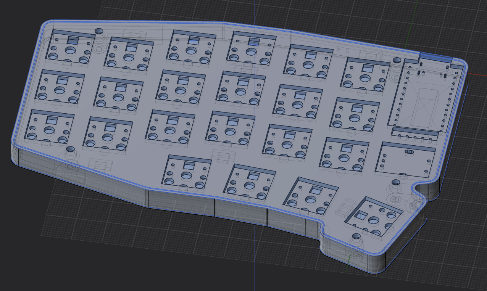

# Keybear

## Directory Structure

- firmware: contain files to setup the firmware of the board.
  - kmk: [kmk firmware](https://github.com/KMKfw/kmk_firmware) config files.
- keybear-chocolate: all files used to create the chocolate version of the board.
  - case:
    - gcode_and_obj: Files used to print the case
    - plasticity_archive: old versions of the plasticity file.
    - keybear-choco_case_slim.plasticity: Latest plasticity file.
- kicad_footprints: footprints used in my kicad projects.

loyalty trust and peysion
